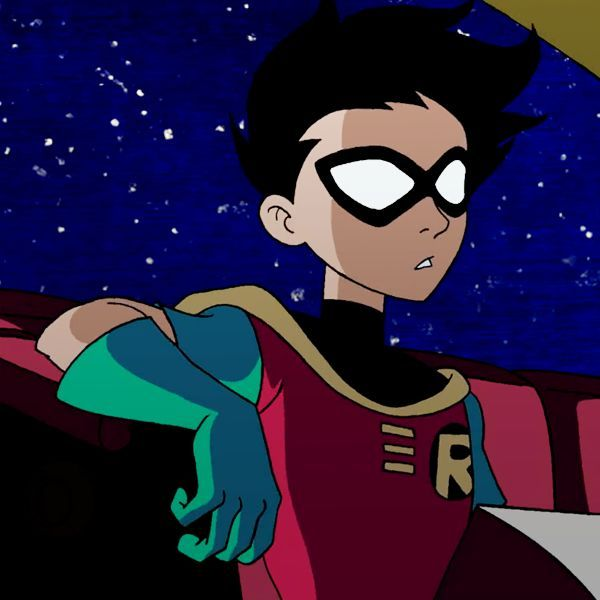

<a name="readme-top"></a>

<br/>
<div align="center">
  
  <h3 align="center">WD-RobinWebPage</h3>
</div>

<div align="center">
  A Teen Titans-themed web project showcasing 5 creative header and footer designs based on Robin.
</div>

<br/>


---

<details>
  <summary>Table of Contents</summary>
  <ol>
    <li>
      <a href="#overview">Overview</a>
      <ol>
        <li><a href="#key-components">Key Components</a></li>
        <li><a href="#technology">Technology</a></li>
      </ol>
    </li>
    <li><a href="#rules-practices-and-principles">Rules, Practices and Principles</a></li>
    <li><a href="#resources">Resources</a></li>
  </ol>
</details>

---

## Overview

This is a single-page web design project for Web Design subject. It focuses on Robin from Teen Titans, using colors and layout that represent his character. The site features **five different headers** and **five unique footers**, all styled with HTML and CSS.

### Key Components
- Multi-section HTML5 website
- Responsive design using pure HTML and CSS
- Navigation bar with smooth scrolling and hamburger menu
- Custom **About**, **Skills**, **Team**, and **Contact** sections
- Hero section showcasing Robin
- GitHub-hosted via GitHub Pages

### Technology


## Rules, Practices and Principles
1. Project folder name starts with `WD-`.
2. The homepage file is named `index.html`.
3. File structure separates content by type (HTML, CSS, images).
4. Folders named based on usage (`css`, `img`, etc.).
5. Use **external CSS** only — no inline styles.
6. Use **camelCase** or **kebab-case** consistently for file names.
7. Structure:


```
WD-S2--Teen-Titans
└─ assets
|   └─ css
|   |   └─ style.css
|   └─ img
|   |   └─ fileWith.jpeg/.jpg/.webp/.png
|   └─ js
|       └─ script.js
└─ pages
|  └─ pageName
|     └─ assets
|     |  └─ css
|     |  |  └─ style.css
|     |  └─ img
|     |  |  └─ fileWith.jpeg/.jpg/.webp/.png
|     |  └─ js
|     |     └─ script.js
|     └─ index.html
└─ index.html
└─ readme.md
```

## Resources

## 📸 Preview



---

## 👤 About Me

**From Sidekick to Leader**

Trained by Batman, Robin has transformed into a strategic leader. His evolution from Gotham's shadows to Jump City's spotlight defines the leadership and teamwork featured in this project.

---

## 🦸‍♂️ Team Stats
- **5+** Years Leading
- **100+** Missions Completed
- **4** Team Members

---

## 📬 Contact

Feel free to reach out via the [Contact](./contact.html) section or message Robin at `robin@teentitans.hero`.

---

© 2025 Robin - Teen Titans Leader. Protecting Jump City and beyond.
